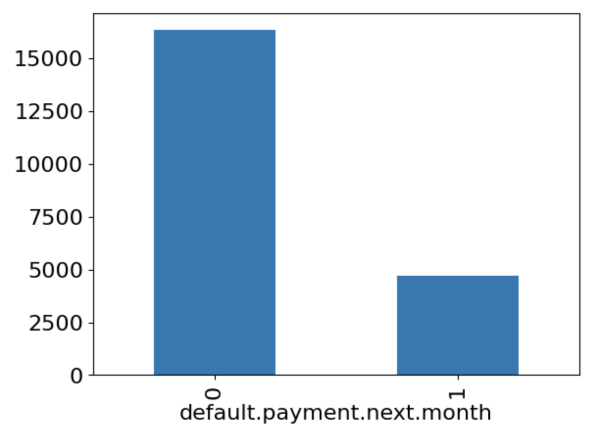
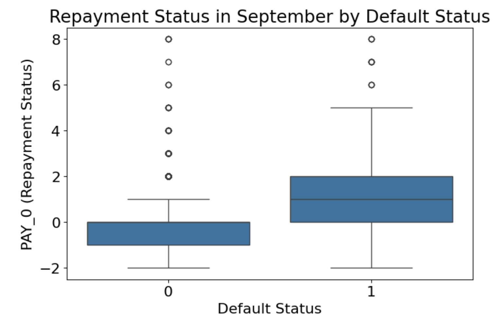

# Predicting Credit Card Defaults with Machine Learning
## Erhan Asad Javed & Jun He Cui

This analysis provides an overview of our analysis and modeling efforts to predict credit card defaults using the **Default of Credit Card Clients Dataset**. The target audience is someone with a solid technical foundation but limited prior exposure to machine learning.

---
## Introduction

  

Predicting whether a customer will default on their credit card payment is a critical task for financial institutions. Credit card defaults can result in significant financial losses for banks and lenders, making it essential to identify high-risk customers before defaults occur. This problem falls under the category of binary classification in machine learning, where the goal is to predict a "default" (1) or "no default" (0) outcome based on customer data.

The dataset used for this analysis, [Default of Credit Card Clients Dataset](https://www.kaggle.com/uciml/default-of-credit-card-clients-dataset), contains demographic, financial, and repayment information of 30,000 clients. This rich dataset provides an opportunity to explore various predictive modeling techniques and gain insights into customer behavior.

### Why Is This Analysis Important?

1. **Financial Risk Mitigation**: By identifying potential defaulters in advance, financial institutions can take proactive measures such as revising credit limits or offering personalized repayment plans, thereby minimizing financial losses.

2. **Improved Resource Allocation**: Knowing which customers are at risk allows banks to focus their resources on high-risk accounts, optimizing their collections and risk management strategies.

3. **Data-Driven Decision Making**: This analysis demonstrates the power of machine learning to uncover patterns and relationships in data that might not be immediately apparent, enabling better decision-making.

4. **Customer Retention**: Understanding the factors leading to default can also help institutions design interventions to retain customers and support them in avoiding default, fostering better customer relationships.

Through this analysis, we aim to not only build predictive models but also provide insights into the factors influencing credit card defaults. This understanding can be leveraged to make the lending process more equitable, efficient, and resilient.

The objective was to predict whether a client will default on their credit card payment next month. This is a binary classification 
problem where the target variable, `default.payment.next.month`, is labeled as `1` (default) or `0` (no default). The analysis aimed to assist financial institutions in identifying high-risk customers.

---

## Dataset Description
The dataset contains 30,000 samples and 24 features, including:
- **Demographics**: Gender, age, education, marital status.
- **Financial Information**: Credit limit (`LIMIT_BAL`), past bill amounts (`BILL_AMT1` to `BILL_AMT6`), and repayment status (`PAY_0` to `PAY_6`).
- **Target Variable**: `default.payment.next.month`.

### Feature Description Table

| Feature Name                 | Description                                                                 |
|------------------------------|-----------------------------------------------------------------------------|
| `ID`                         | ID of each client                                                          |
| `LIMIT_BAL`                  | Amount of given credit in NT dollars (includes individual and family credit)|
| `SEX`                        | Gender (1 = male, 2 = female)                                              |
| `EDUCATION`                  | Education level (1 = graduate school, 2 = university, 3 = high school, 4 = others, 5/6 = unknown) |
| `MARRIAGE`                   | Marital status (1 = married, 2 = single, 3 = others)                       |
| `AGE`                        | Age in years                                                              |
| `PAY_0`                      | Repayment status in September 2005 (-1 = pay duly, 1 = delay 1 month, ..., 9 = delay 9+ months) |
| `PAY_2`                      | Repayment status in August 2005 (same scale as `PAY_0`)                   |
| `PAY_3`                      | Repayment status in July 2005 (same scale as `PAY_0`)                     |
| `PAY_4`                      | Repayment status in June 2005 (same scale as `PAY_0`)                     |
| `PAY_5`                      | Repayment status in May 2005 (same scale as `PAY_0`)                      |
| `PAY_6`                      | Repayment status in April 2005 (same scale as `PAY_0`)                    |
| `BILL_AMT1`                  | Amount of bill statement in September 2005 (NT dollar)                   |
| `BILL_AMT2`                  | Amount of bill statement in August 2005 (NT dollar)                      |
| `BILL_AMT3`                  | Amount of bill statement in July 2005 (NT dollar)                        |
| `BILL_AMT4`                  | Amount of bill statement in June 2005 (NT dollar)                        |
| `BILL_AMT5`                  | Amount of bill statement in May 2005 (NT dollar)                         |
| `BILL_AMT6`                  | Amount of bill statement in April 2005 (NT dollar)                       |
| `PAY_AMT1`                   | Amount of previous payment in September 2005 (NT dollar)                 |
| `PAY_AMT2`                   | Amount of previous payment in August 2005 (NT dollar)                    |
| `PAY_AMT3`                   | Amount of previous payment in July 2005 (NT dollar)                      |
| `PAY_AMT4`                   | Amount of previous payment in June 2005 (NT dollar)                      |
| `PAY_AMT5`                   | Amount of previous payment in May 2005 (NT dollar)                       |
| `PAY_AMT6`                   | Amount of previous payment in April 2005 (NT dollar)                     |
| `default.payment.next.month` | Default payment (1 = yes, 0 = no)                                         |

### Key Observations:
1. **Class Imbalance**:  
   | Class                  | Count   | Percentage |
   |------------------------|---------|------------|
   | Non-defaulting clients | 23,310  | 77.7%      |
   | Defaulting clients     | 6,690   | 22.3%      |

2. **Demographics**:
   - Majority of clients are in their 20s and 30s, with an average age of 35.5.
   - Slightly more female clients than male.
   - Most clients have a university education, with fewer at graduate or high school levels.

3. **Repayment Status**:
   - Delays in repayment correlate with higher default probabilities.

---

## Exploratory Data Analysis (EDA)
### Visualizations:
1. **Class Distribution**: Highlighted the imbalance between defaulting and non-defaulting clients.
2. **Repayment Status**: Delays in September (most recent data point) showed a strong association with default rates.  
3. **Age and Credit Limit Trends**: Explored demographic patterns affecting default behavior.

#### Figure 1: 

Figure 1 indicates that there is class imbalance based on the proportions of de-
fault.payment.next.month. Additional statistics described 77.7% having no payment next month
and 22.3% having payment next month. This means that a dummy classifier that just predicts ‘0’
would have reasonable accuracy.

#### Figure 2

Figure 2 describes the distribution of the repayment status in September, which is the most recent
status. There seems to be an association between more delays in repayment status and being
classified as default payment, which logically makes sense. This implies that this will potentially
be an important feature in our classification models.

---

## Feature Engineering and Preprocessing
### Steps Taken:
1. **Dimensionality Reduction**:
   - Averaged bill amounts (`AVG_BILL_AMT`) and payment amounts (`AVG_PAY_AMT`).
2. **Scaling**:
   - Normalized numeric features (`LIMIT_BAL`, `AGE`, `AVG_BILL_AMT`, `AVG_PAY_AMT`).
3. **Encoding**:
   - Categorical variables (`MARRIAGE`, `EDUCATION`) were encoded ordinally to preserve hierarchy.

---

## Model Selection and Results
We tested multiple models and tuned hyperparameters to optimize performance:

### Table 1: Model Comparison Table:
| Model                 | Best Hyperparameters                    | Cross-Validation Score | Test Score |
|-----------------------|------------------------------------------|-------------------------|------------|
| Random Forest         | `n_estimators=50, max_depth=5`          | 0.83                    | 0.82       |
| Decision Tree         | `max_depth=5`                           | 0.819                   | 0.819      |
| Logistic Regression   | `C=1`                                   | 0.810                   | 0.810      |
| kNN                   | `n_neighbors=17`                        | 0.813                   | 0.813      |

### Table 2: Random Forest Performance Metrics:
| Metric    | Score |
|-----------|-------|
| Precision | 0.66  |
| Recall    | 0.37  |
| F1 Score  | 0.48  |

The above tables indicate best performing model was of type RandomForestClassifier with the
above hyperparameters, which had a test score of 0.82 while the cross validation score was very
similar, implying that the model did not overfit. We could have tried other models such as Linear
SVM for additional improvement. An idea we did not try but could improve the performance is
to optimize the recall. This would minimize the amount of false negatives which is preferable to
increase the amount of defaulting clients detected. This could be done by lowering the decision
threshold with predict_proba.

---

## Final Remarks

One significant issue is the imbalance in the dataset, with a far larger proportion of non-defaulting clients. This imbalance allowed the Dummy Classifier, which predicts all clients as non-defaulting, to achieve a 77% accuracy, highlighting the need for better handling of imbalanced data.

Another issue is potential underfitting of our model, as evidenced by a very low recall score relative to the accuracy. This indicates that the model generates many false negatives, suggesting it fails to capture the nuances in the data necessary for accurately predicting positive cases. In the future, we could explore more complex models or feature engineering techniques to address this limitation.

Lastly, during feature engineering, we averaged values for `BILL_AMT` and `PAY_AMT` to reduce dimensionality. While this simplified the dataset, it may have discarded valuable information. To improve, we could explore alternative methods for dimensionality reduction that retain more of the dataset’s predictive power, such as clustering or selecting representative features.

This analysis demonstrates the practical application of machine learning in financial risk management. By identifying patterns in client behavior, institutions can make more informed decisions and mitigate risk effectively.

--- 

## Acknowledgments

We would like to express our sincere gratitude to the instructors and teaching assistants of **CPSC 330: Applied Machine Learning** at the University of British Columbia. Their guidance, support, and insightful lectures provided us with a strong foundation in machine learning concepts and practical skills. This analysis was adapted from a open-ended homework assignment.

Special thanks for designing thought-provoking assignments like this one, which challenged us to apply our knowledge to real-world problems and enhance our critical thinking. The feedback and resources provided throughout the course were invaluable in deepening our understanding of the subject. 

This project would not have been possible without their dedication to fostering a collaborative and enriching learning environment. Thank you for inspiring us to explore the fascinating field of machine learning!
